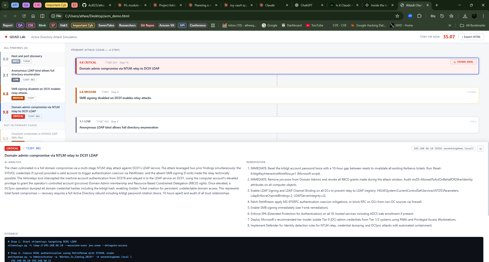

# attack-chain-mapper

> Turns raw pentest findings into an interactive attack chain visualization.
> Works with any tool output. No server required.

<!-- Screenshot: open /tmp/acm_demo.html and replace this image -->


---

## The problem

Flat finding lists don't tell the story a CISO needs — they show *what* was found but not *how* the attacker moved from initial access to domain compromise. attack-chain-mapper reconstructs the actual attack path and renders it as an interactive chain diagram with one click.

## What it produces

A single self-contained HTML file you can email, open in any browser, or embed in a report:

- **Interactive SVG chain** — primary attack path rendered bottom-to-top, entry point at the bottom, crown jewel at the top, animated flow arrows showing progression
- **Finding detail drawer** — click any node to see AI-generated analysis, remediation steps, MITRE ATT&CK link, and evidence
- **Chain risk score** — aggregate severity score for the full chain, prominent for CISO review
- **Left panel** — all findings ranked by severity, colour-coded, with chain membership badges
- **Timeline bar** — horizontal axis at the bottom showing step index and timestamp progression
- **Multiple chains** — if the engagement has independent attack chains, each gets its own tab
- **Export button** — downloads the chain as a self-contained HTML file

---

## Quick start

```bash
git clone https://github.com/Azi023/attack-chain-mapper
cd attack-chain-mapper
python -m venv .venv && source .venv/bin/activate
pip install -e ".[dev]"
python demo/run_demo.py        # generates /tmp/acm_demo.html
open /tmp/acm_demo.html        # or xdg-open on Linux
```

No API key needed — the demo uses pre-written AI details from the GOAD fixture.

---

## CLI reference

### `acm discover` — inspect any file before processing

```bash
acm discover path/to/your_tool_output.json
```

```
  File:        engagement.json
  Format:      generic
  Findings:    12
  Chain links: enabled_by present on 8 of 12 findings

  Field mapping:
    id                           ✓ found
    title                        ✓ found
    severity                     ✓ found  [source: cvss_score]
    mitre_technique              ✓ found
    enabled_by                   ✓ found

  Missing optional fields (will be null):
    step_index                   — not present
```

### `acm chain` — generate the visualization

```bash
acm chain path/to/findings.json --output report.html

# With AI enrichment (requires Anthropic API key)
ANTHROPIC_API_KEY=sk-ant-... acm chain findings.json --output report.html --model claude-sonnet-4-5
```

### `acm list` — view stored engagements

```bash
acm list
```

```
  ENGAGEMENT ID                        TARGET               CHAINS   LATEST DATE          RISK
  ------------------------------------ -------------------- ------- -------------------- -----
  goad-2024-demo-001                   GOAD Lab             1       2026-03-17T10:45     35.1
```

### `acm history` — all chains for an engagement

```bash
acm history goad-2024-demo-001
```

### `acm diff` — compare two chain snapshots

```bash
acm diff ac7f5834 b55f1034
```

```
  Diff: ac7f5834 → b55f1034
  Risk score delta: -26.6
  Primary path changed: yes

  New findings (2):
    + [0.5] Port scan
    + [8.0] New finding

  Resolved findings (6):
    - [9.8] Domain admin compromise via NTLM relay to DC01 LDAP
    ...
```

### `acm scaffold-adapter` — generate a custom adapter for unknown formats

```bash
acm scaffold-adapter path/to/unknown_format.json
# Prints a Claude Code prompt that generates a working adapter
```

---

## Integrating with your tool

attack-chain-mapper is designed to work alongside any pentest platform, scanner,
or AI agent — without requiring changes to your existing codebase.

### Step 1: Check if your output is recognized

```bash
acm discover path/to/your_tool_output.json
```

This shows which fields were detected and whether chain inference will be needed.

### Step 2: Generate the chain

```bash
acm chain path/to/your_tool_output.json --output report.html
```

### Step 3: If your format isn't recognized

```bash
# Generate a custom adapter (requires Anthropic API key)
acm scaffold-adapter path/to/your_output.json

# Or let the tool detect it automatically
acm chain path/to/your_output.json --output report.html
# → "Format not recognized — running AI format detection..."
```

### Python API (for platform integration)

```python
from attack_chain_mapper import build_chain

chain = build_chain(
    engagement_data=your_findings_dict,
    api_key="sk-ant-...",   # optional
    store=True,             # save to local SQLite
)
html = chain.render_html()        # embed in your report pipeline
data = chain.to_json()           # store or forward to downstream systems

# Multi-chain access
for cr in chain.chains:
    print(f"{cr.label}: {cr.chain_risk_score:.2f}")
```

### What attack-chain-mapper needs from your data

The minimum required fields for a useful chain:
- Finding title or name
- Severity (numeric or label — CRITICAL/HIGH/MEDIUM/LOW/INFO)

Optional but improve quality significantly:
- MITRE ATT&CK technique (T-number)
- Step index or timestamp
- Evidence or proof text
- `enabled_by` (IDs of findings that made this one possible)

If `enabled_by` is absent — which is normal — the tool infers chain
relationships automatically from severity progression and step ordering.

---

## Multiple attack chains

attack-chain-mapper automatically detects disconnected attack chains within a single engagement. If you have findings from multiple target systems or attack paths with no shared prerequisites, each is rendered as a separate chain.

When multiple chains are detected:
- A **tab bar** appears at the top of the chain panel: `Chain 1 · 35.07` | `Chain 2 · 18.42`
- Each chain has its own Crown Jewel and Entry Point
- The left panel shows all findings with `C1`/`C2`/`C3` badges
- Findings not in any chain's primary path appear in "Not in Any Chain"
- The header shows the primary (highest-risk) chain's score

The highest-risk chain is always Chain 1. Chains are scored and sorted by risk automatically.

---

## AI enrichment (optional)

Provide your own Anthropic API key to generate per-finding analysis:

```bash
export ANTHROPIC_API_KEY=sk-ant-...
acm chain findings.json --output report.html --model claude-sonnet-4-5
```

What AI enrichment adds:
- Full technical analysis for each finding (adapted to evidence richness)
- Step-by-step remediation guidance
- AI confidence score per finding
- MITRE ATT&CK technique descriptions

Without an API key: the chain renders immediately using any pre-written AI details in the fixture. The visualization is fully functional — only the per-finding analysis section will be empty.

Recommended models: `claude-sonnet-4-5` or `claude-sonnet-4-6`.

> **Privacy:** All finding data is local. Nothing leaves your machine unless you explicitly configure an external AI API call with `--api-key` or `ANTHROPIC_API_KEY`. This is documented in every CLI help string.

---

## Architecture

| Component | Technology | Notes |
|-----------|-----------|-------|
| Finding schema | Pydantic v2 | Locked contract — adapters map TO this |
| Graph engine | NetworkX DAG | Longest weighted path = primary chain |
| Chain inference | Heuristic + MITRE | Auto-infers `enabled_by` when absent |
| Renderer | Pure HTML + vanilla JS | Single self-contained file, no framework |
| AI enrichment | Anthropic API (BYOK) | One call per finding, async-safe |
| Storage | SQLite WAL | Chains saved locally for diff/history |
| API | FastAPI | `POST /chain` → graph JSON + rendered HTML |

---

## Privacy

All processing is **local by default**:

- Finding data never leaves your machine unless you provide an Anthropic API key
- SQLite database is stored at `~/.attack-chain-mapper/chains.db`
- HTML output contains no credentials — safe to email or attach to reports
- AI API calls are per-finding and non-blocking; you can disable them with `--no-ai-detect`

---

## Finding schema

The schema is the contract. Adapters map TO it; the schema never changes to suit adapters.

```python
class Finding(BaseModel):
    id: str                        # unique within engagement
    title: str                     # short human title
    severity: float                # CVSS-style 0.0–10.0
    severity_label: str            # CRITICAL / HIGH / MEDIUM / LOW / INFO
    mitre_technique: Optional[str] # T-number e.g. "T1557.001"
    step_index: Optional[int]      # which step produced this finding
    timestamp_offset_s: Optional[int]  # seconds from engagement start
    enabled_by: List[str]          # finding IDs that made this possible
    evidence: Optional[str]        # raw evidence string (redacted is fine)
    host: Optional[str]            # target host/IP
    # AI-generated fields (populated after graph is built)
    ai_detail: Optional[str]
    ai_remediation: Optional[str]
    ai_confidence: Optional[float]
```

---

## Adding a custom adapter

Use the scaffold command to generate a ready-to-implement adapter:

```bash
acm scaffold-adapter path/to/your_output.json
```

This prints a Claude Code prompt that inspects your format and generates a working adapter. Paste it into Claude Code — no one needs to know your internal schema.

Or implement manually following `src/ingestion/adapters/generic.py`:
- One file per format in `src/ingestion/adapters/`
- Register in `src/ingestion/adapters/__init__.py`
- Implement `can_handle(cls, data)`, `parse(self, data) -> Engagement`, `describe_mapping(self, data) -> dict`

---

## PIL F7 integration

```python
from attack_chain_mapper import build_chain

# One-line integration
chain = build_chain(engagement_data=your_pil_output, api_key=api_key, store=True)

# Embed in report
report["attack_chain_html"] = chain.render_html()
report["chain_risk_score"] = chain.chain_risk_score
report["chain_count"] = chain.chain_count
report["total_engagement_risk"] = chain.total_engagement_risk
```

---

## Running with Claude Code

If you want Claude Code to integrate attack-chain-mapper into your existing
pentest platform or AI agent pipeline, use this prompt:

<details>
<summary>Claude Code integration prompt (click to expand)</summary>

```
You are integrating attack-chain-mapper into [YOUR TOOL NAME].
Repository: https://github.com/Azi023/attack-chain-mapper

First, read the README at that URL to understand the tool's architecture,
finding schema, and Python API.

Then do the following:

1. Install the package:
   pip install git+https://github.com/Azi023/attack-chain-mapper.git

2. Run the demo to verify it works:
   python -m acm chain demo/fixtures/goad_sample.json --output /tmp/test_chain.html
   Confirm /tmp/test_chain.html is > 20KB.

3. Export a sample output from [YOUR TOOL] as JSON and run:
   python -m acm discover path/to/your_output.json
   Report what fields were detected and whether chain inference will be applied.

4. If the format is recognized: integrate using the Python API:
   from attack_chain_mapper import build_chain
   chain = build_chain(engagement_data=your_findings, api_key=YOUR_KEY)
   html = chain.render_html()

5. If the format is NOT recognized: run the scaffold-adapter command and
   implement the generated adapter before integrating.

6. Do NOT modify attack-chain-mapper's source code to fit your format.
   The adapter pattern is the correct integration point — see src/ingestion/adapters/generic.py.

7. Verify the integration works end-to-end on real data from your tool before
   committing. The chain should show at least 2 connected nodes for the test to
   be meaningful.

Use model: claude-sonnet-4-5 or claude-sonnet-4-6 for best results.
```

</details>

---

## Development

```bash
# Install
pip install -e ".[dev]"

# Run demo (no API key needed)
python demo/run_demo.py

# Run tests
python -m pytest tests/ -q

# Discover format of an existing file
acm discover sample.json

# Generate a chain
acm chain sample.json --output chain.html

# Generate a chain with AI details
ANTHROPIC_API_KEY=sk-ant-... acm chain sample.json --output chain.html --model claude-sonnet-4-5

# Start API server
uvicorn src.api.app:app --port 8200
```

---

## License

MIT — see [LICENSE](LICENSE)
